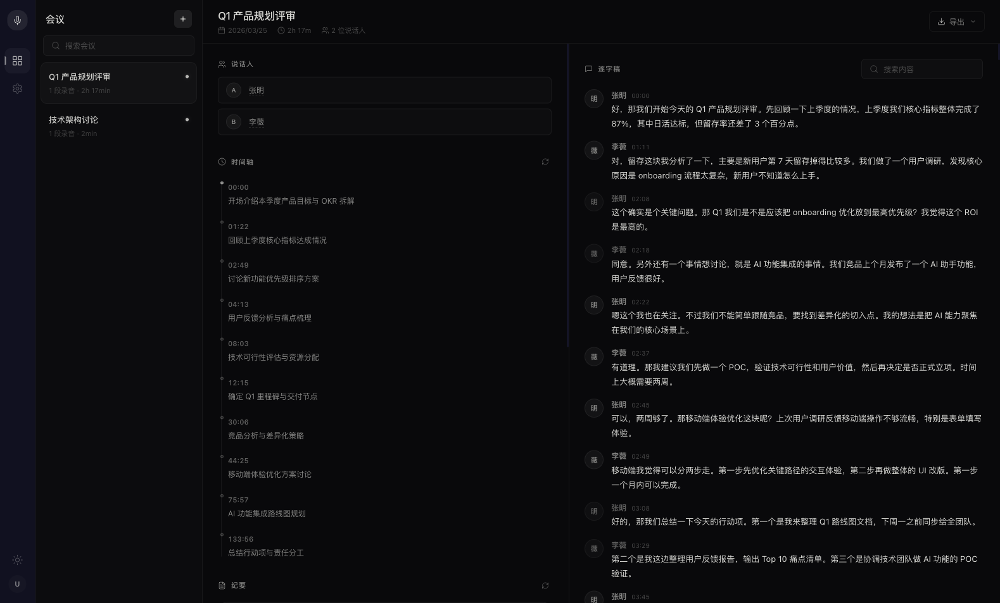
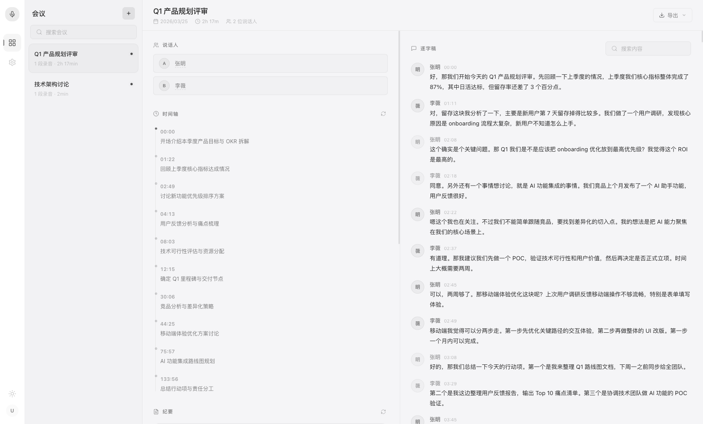
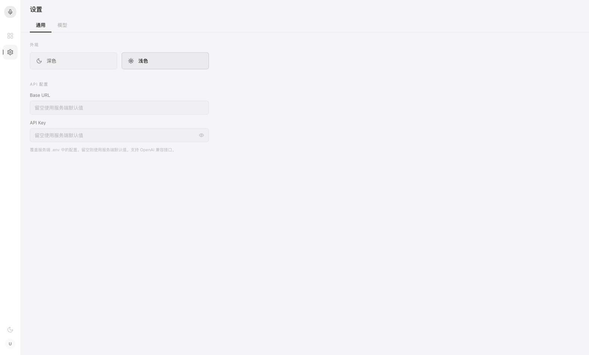

# Meeting Transcriber

> 会议语音转写 + 说话人分离 + AI 智能摘要 — 上传录音，自动生成逐字稿、Topic 时间轴、会议纪要和行动项。

## 预览

**深色主题 — 会议结果**


**浅色主题 — 会议结果**


<details>
<summary>更多截图</summary>

**设置 — 通用（API 配置 / 主题切换）**


**设置 — 模型（转录 / 摘要模型选择 + 可用性检测）**


</details>

## 核心功能

| 功能 | 说明 |
|------|------|
| 语音转文字 | GPT-4o Transcribe / Whisper，支持中英文混合 |
| 说话人分离 | FunASR FSMN-VAD + CAM++ 说话人聚类 |
| Topic 时间轴 | AI 提炼会议主线，展示每个阶段讨论的核心议题 |
| 智能摘要 | 一键生成纪要、关键词、行动项，支持独立重新生成 |
| 逐字稿 | 按说话人分段，带时间戳，支持全文搜索 |
| 说话人编辑 | 重命名说话人标签（Speaker A → 张明） |
| 导出 | SRT 字幕 / TXT 纯文本 / Markdown 会议纪要 |
| 深色/浅色主题 | CSS 变量驱动，一键切换 |
| 模型可配置 | 前端可覆盖转录模型、摘要模型、API Key、Base URL |
| 模型检测 | 切换模型时自动验证可用性 |
| 剪贴板上传 | Ctrl/Cmd+V 直接粘贴音频文件 |
| 实时进度 | WebSocket 推送 6 步处理进度 + ETA |

## 架构

```
┌──────────┐    ┌───────────┐    ┌──────────────┐
│ Frontend │───▸│  FastAPI   │───▸│ Celery Worker│
│ React/TS │◂──▸│  REST+WS   │    │  6-step pipe │
└──────────┘    └─────┬─────┘    └──┬───┬───┬───┘
                      │             │   │   │
                ┌─────▾─────┐  ┌───▾┐ ┌▾┐ ┌▾──────┐
                │ SQLite/PG │  │VAD │ │D│ │OpenAI  │
                │  + Redis  │  │8001│ │8002│ API   │
                └───────────┘  └────┘ └──┘ └───────┘
                                 FunASR    CAM++
```

**处理 Pipeline（6 步）**

1. **合并** — ffmpeg 转 16kHz 单声道 WAV
2. **VAD** — FSMN-VAD 检测语音段
3. **说话人分离** — CAM++ 嵌入 + KMeans 聚类
4. **转写** — GPT-4o Transcribe 并发转写（Semaphore 控制）
5. **NLP** — GPT-4o 生成摘要 / 时间轴 / 关键词 / 行动项
6. **保存** — 写入数据库，推送完成状态

## 快速开始

### 前置依赖

- Python 3.11+ / [uv](https://github.com/astral-sh/uv)
- Node.js 18+ / npm
- Redis（`brew install redis && brew services start redis`）
- ffmpeg（`brew install ffmpeg`）
- OpenAI API Key（支持代理 / 兼容接口）

### 本地开发

```bash
# 1. 克隆 & 配置
git clone <repo-url> && cd meetingai
cp .env.example .env
# 编辑 .env 填写 OPENAI_API_KEY（必须）和 OPENAI_BASE_URL（可选）

# 2. 启动后端（ML 服务 + Worker + API）
./start_local.sh

# 3. 启动前端（另开终端）
cd frontend && npm install && npm run dev
```

打开 http://localhost:3000 即可使用。

### Docker 部署

```bash
cp .env.example .env  # 配置 API Key
docker compose up --build -d
```

访问 http://localhost:3000。

## 项目结构

```
meetingai/
├── backend/
│   ├── api/              # FastAPI 路由（REST + WebSocket）
│   │   └── routes/       # meetings / system / websocket
│   ├── core/             # 配置、数据库、Redis
│   ├── models/           # SQLAlchemy 模型
│   ├── services/         # ML 服务客户端
│   │   ├── transcription/  # OpenAI 转写
│   │   ├── diarization/    # 说话人分离
│   │   ├── nlp/            # GPT 摘要生成
│   │   └── vad/            # 语音活动检测
│   └── worker/           # Celery 异步任务
├── ml_services/          # 独立 ML 微服务（VAD + 说话人分离）
├── frontend/
│   └── src/
│       ├── components/   # UI 组件（layout / meeting / ui）
│       ├── contexts/     # Theme + Settings providers
│       ├── hooks/        # React Query hooks
│       ├── pages/        # 会议页 + 设置页
│       └── api/          # Axios 客户端
├── docker-compose.yml
├── start_local.sh        # 一键本地启动
└── pyproject.toml
```

## API 概览

| 方法 | 路径 | 说明 |
|------|------|------|
| POST | `/api/meetings` | 创建会议 |
| GET | `/api/meetings` | 会议列表 |
| GET | `/api/meetings/{id}` | 会议详情 |
| PATCH | `/api/meetings/{id}` | 更新标题 |
| DELETE | `/api/meetings/{id}` | 删除会议 |
| POST | `/api/meetings/{id}/recordings` | 上传录音 |
| POST | `/api/meetings/{id}/process` | 开始处理 |
| POST | `/api/meetings/{id}/regenerate-timeline` | 重新生成时间轴 |
| POST | `/api/meetings/{id}/regenerate-summary` | 重新生成纪要 |
| PATCH | `/api/meetings/{id}/speakers` | 重命名说话人 |
| GET | `/api/meetings/{id}/export/{format}` | 导出（srt/txt/summary） |
| WS | `/ws/meetings/{id}/progress` | 实时进度推送 |
| POST | `/api/check-model` | 检测模型可用性 |
| GET | `/api/progress/{id}` | 查询任务进度 |

## 技术栈

**后端:** FastAPI, Celery, SQLAlchemy, Redis, FunASR, OpenAI API

**前端:** React 18, TypeScript, TanStack Query, Tailwind CSS, Vite

**ML:** FSMN-VAD (语音活动检测), CAM++ (说话人嵌入), KMeans (聚类)

## License

MIT
